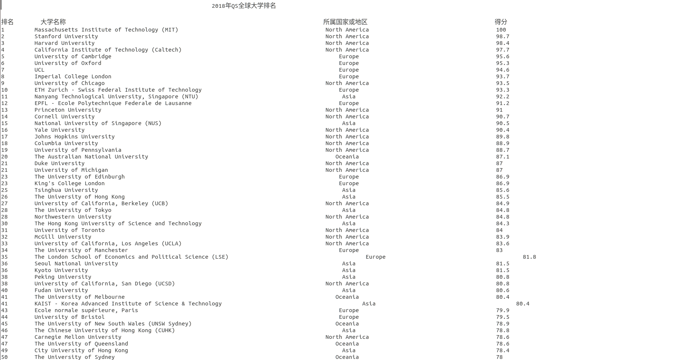

# This is a python crawler repository.


## 项目介绍
### 1. [软科中国最好大学排名爬虫](https://github.com/zyingzhou/python-crawler/blob/master/zuihaodaxue.py "软科中国最好大学爬虫")
这个文件是爬取了[软科中国最好大学](http://www.zuihaodaxue.com/zuihaodaxuepaiming2018.html)2016年至2018年三年的排名信息。这是爬取到的排名部分截图：。


### 2. [多媒体资源爬虫](https://github.com/zyingzhou/python-crawler/blob/master/crawl_media_source.py "多媒体资源爬虫")
这个爬虫主要爬取url中带有“.mp4”,“.mp3”,“.jpg”等后缀名的服务器上对应的资源。


### 3. [猫眼电影Top100电影爬虫](https://github.com/zyingzhou/python-crawler/blob/master/maoyan_top100_films_parser.py "猫眼电影Top100电影爬虫")
这个爬虫主要爬取的是[猫眼网站上排名前100名](http://maoyan.com/board/4)的电影信息。部分结果展示：


### 4.[浙江大学官网微积分课程视频爬虫](https://github.com/zyingzhou/python-crawler/blob/master/ZJU_MOOC_spider.py "浙江大学官网微积分课程视频爬虫")
这是爬取到的部分课程视频的截图：


### 5.[QS世界大学排名爬虫](./qs_rank_spider.py "QS世界大学排名爬虫")
> This spider for crawling [QS World University Rankings](https://www.topuniversities.com/university-rankings/world-university-rankings/2018). 

> #### 5.1 安装Python第三库
>安装[requests](http://docs.python-requests.org/en/master/)库 


> #### 5.2 分析Ajax接口
> a.通过Chrome开发工具采集到网页的加载过程，即浏览器和服务器之间的通信过程。
> 
> b.分析network中的每一条XHR数据。分别点击headers项，Preview项和Response项，headers项中包含请求的头和响应头的信息，Response项是服务器返回的内
> 容，Preview中可以预览这些内容。
>
> c.通过分析发现名字为357051.txt?_=1525515172753 的XHR文件正是我们要找的，通过headers可以查看url,通过Preview可以看到请求返回来的内容。


> #### 5.3 构造下载函数
```

 def get_page(url):
      try:
        r = requests.get(url, headers=headers)
        if r.status_code == 200:
            return r.json()
    except requests.ConnectionError as e:
        print(e)
```

> #### 5.4 解析函数
```
   def parser_page(json):
   if json:
        items = json.get('data')
        for i in range(len(items)):
            item = items[i]
            qsrank = {}
            if "=" in item['rank_display']:
                rk_str = str(item['rank_display']).split('=')[-1]
                qsrank['rank_display'] = rk_str
            else:
                qsrank['rank_display'] = item['rank_display']
            qsrank['title'] = item['title']
            qsrank['region'] = item['region']
            qsrank['score'] = item['score']
            # url可根据需求提取
            qsrank['url'] = item['url']
            yield qsrank
```


> #### 5.5 总结
> 爬取的难点主要是分析Ajax接口，只有分析出接口得到了URL才能爬取到数据。
> 爬取结果： 
> 

